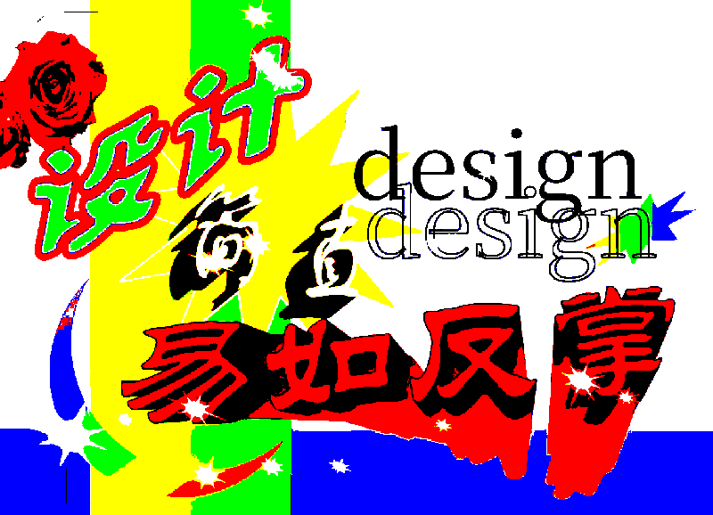
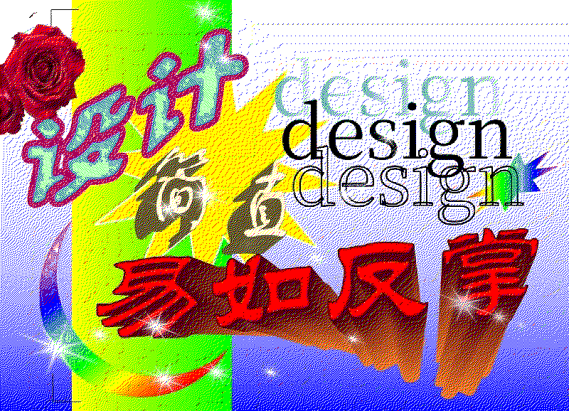
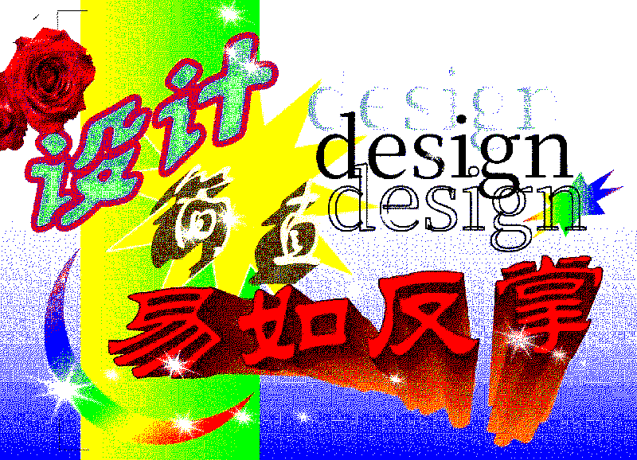
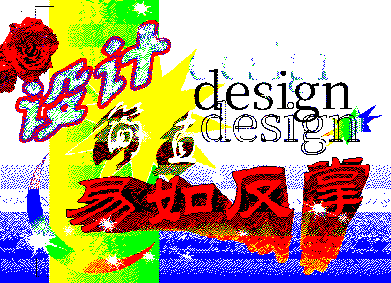
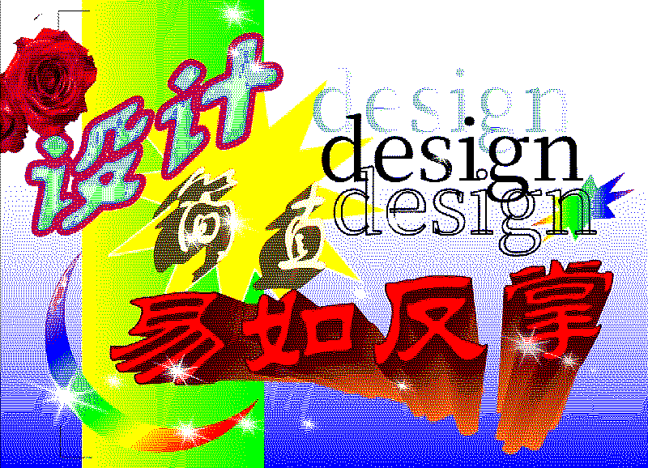

# 📟 EInk Dither

A Dart/Flutter package for applying **dithering algorithms** to images destined for
**E-Ink (electronic ink) displays**. It quantizes a full-color image to the E-Ink palette
while minimizing banding and contour artifacts. Typical use cases include
**E-Ink Displays**, Thermal Printers, and LED / Dot-Matrix Screens.

[](https://pub.dev/packages/eink_dither)
[](LICENSE)
[](https://runoob-coder.github.io/eink_dither/)
[](https://pub.dev/documentation/eink_dither/latest/)
[](https://github.com/runoob-coder/eink_dither)

Language: English | [中文](https://github.com/runoob-coder/eink_dither/blob/master/README_CN.md)

## ✨ Features

- **8 dithering kernels** — error-diffusion (Floyd–Steinberg, Stucki, Atkinson,
  Jarvis–Judice–Ninke, Burkes, False Floyd–Steinberg (Heckbert)), ordered (Bayer 2×2/4×4/8×8,
  Blue Noise), and none (no dithering).
- **4 scan orders** for error-diffusion kernels (raster, serpentine, zigzag, Hilbert
  space-filling curve).
- **8 E-Ink palettes** — from pure black/white up to 7-color (Gallery 7) and 16-level
  grayscale (Carta 16).
- Universal quantizer `EInkPaletteQuantizer` that maps any color to the nearest E-Ink
  color in a palette using Euclidean RGB distance.
- A configurable `EInkImageProcessor` with both synchronous (`process`) and isolate-based
  asynchronous (`processIsolated`) processing.

## 📦 Installation

Install via pub.dev → [pub.dev/packages/eink_dither/install](https://pub.dev/packages/eink_dither/install)

[Live Demo](https://runoob-coder.github.io/eink_dither/) — try it out online

## 🚀 Quick Start

```dart
import 'dart:typed_data';
import 'dart:io';
import 'package:eink_dither/eink_dither.dart';

Future<void> main() async {
  final Uint8List bytes = await File('photo.jpg').readAsBytes();

  // 1. Configure the processor.
  final processor = EInkImageProcessor(
    palette: EInkPalette.spectra6,
    ditherKernel: DitherKernel.floydSteinberg,
    scanOrder: DitherScanOrder.serpentine,
    intensity: 1.0,
    maxSize: 700,
  );

  // 2a. Synchronous processing (blocks the current thread).
  final image = processor.process(bytes);

  // 2b. Asynchronous processing in a compute isolate (recommended for UI).
  final image2 = await processor.processIsolated(bytes);

  // 3. Encode the result (e.g. to PNG).
  if (image2 != null) {
    final png = img.encodePng(image2); // `image` package
    await File('out.png').writeAsBytes(png);
  }
}
```

## 📚 [API Reference](https://pub.dev/documentation/eink_dither/latest/)

### 🌈 `EInkColor`

Enum of the ink colors an E-Ink display can render. Includes the CMY/RGB primaries, an
`orange`, and a 16-step gray ramp (`gray1` … `gray14`, where step `i` renders as `i * 17`
in sRGB).

### 🎨 `EInkPalette`

Enum of preset palettes:

| Palette           | Inks | Colors                                         |
|-------------------|:----:|------------------------------------------------|
| `bw`              |  2   | Black, White                                   |
| `spectra3Red`     |  3   | Black, White, Red                              |
| `spectra3Yellow`  |  3   | Black, White, Yellow                           |
| `spectra4`        |  4   | Black, White, Red, Yellow                      |
| `spectra3100Plus` |  5   | Black, White, Red, Yellow, Orange              |
| `spectra6`        |  6   | Black, White, Red, Green, Blue, Yellow         |
| `gallery7`        |  7   | Black, White, Red, Yellow, Blue, Green, Orange |
| `carta16`         |  16  | Black + 14 grays (`i*17`) + White              |

### 🔢 `EInkPaletteQuantizer`

A `Quantizer` (from the `image` package) that maps each pixel to the nearest color of a
palette by Euclidean RGB distance. Construct it directly:

```dart

final quantizer = EInkPaletteQuantizer([EInkColor.black, EInkColor.white]);
// or from a preset type:
final q2 = EInkPaletteQuantizer.of(EInkPalette.spectra6);
```

### ⚙️ `EInkImageProcessor`

`process` runs on the calling thread; `processIsolated` runs the
same work inside a `compute` isolate so the UI never blocks.

| Property       | Type              | Default                       | Description                                                      |
|----------------|-------------------|-------------------------------|------------------------------------------------------------------|
| `palette`      | `EInkPalette`     | `EInkPalette.spectra6`        | Target ink palette.                                              |
| `ditherKernel` | `DitherKernel`    | `DitherKernel.floydSteinberg` | Dithering algorithm.                                             |
| `scanOrder`    | `DitherScanOrder` | `DitherScanOrder.zigzag`      | Pixel-visit order (error-diffusion only).                        |
| `intensity`    | `double`          | `1.0`                         | Dither strength for ordered kernels; ignored by error-diffusion. |
| `maxSize`      | `int`             | `800`                         | Longest edge is capped to this (proportional resize).            |

```dart
img.Image? process(Uint8List bytes);

Future processIsolated(Uint8List bytes);
```

### 🎛️ `DitherKernel`

The dithering algorithm. Error-diffusion kernels (`none` aside) propagate quantization
error to neighbours; ordered kernels (`bayer2x2`, `bayer4x4`, `bayer8x8`, `blueNoise`)
use a fixed threshold matrix and are position-independent.

```dart
enum DitherKernel {
  none,
  falseFloydSteinberg,
  floydSteinberg,
  stucki,
  atkinson,
  jarvisJudiceNinke,
  burkes,
  bayer2x2,
  bayer4x4,
  bayer8x8,
  blueNoise,
}
```

### 🔀 `DitherScanOrder`

The order in which pixels are visited by the error-diffusion kernels. It has **no effect**
on the ordered (Bayer / blue-noise) kernels.

| Scan Order   | Description                                                                                                                                                                                                                                |
|--------------|--------------------------------------------------------------------------------------------------------------------------------------------------------------------------------------------------------------------------------------------|
| `raster`     | Standard raster scan: every row traversed left to right, top to bottom.                                                                                                                                                                    |
| `serpentine` | Boustrophedon (snake) scan: horizontal direction reverses every other row, reducing directional artifacts.                                                                                                                                 |
| `zigzag`     | Diagonal zigzag (JPEG-style) scan: visits pixels along anti-diagonals `x + y == d`, alternating each diagonal's direction, softening the horizontal worm patterns of raster scanning.                                                      |
| `hilbert`    | Hilbert space-filling curve: consecutive pixels are adjacent on the grid, maximizing spatial locality; best reduction of directional artifacts among deterministic orders, approximating random-walk diffusion without losing determinism. |

## 🖼️ Algorithm Examples

All previews below were generated with `EInkPalette.spectra6` at `maxSize: 700`.

### 🟦 Ordered dithering

These kernels ignore `scanOrder`. `intensity` (threshold strength) applies to them only.

| Algorithm             | Preview                                       |
|-----------------------|-----------------------------------------------|
| `none` (no dithering) |       |
| `bayer2x2`            |   |
| `bayer4x4`            |   |
| `bayer8x8`            |   |
| `blueNoise`           |  |

### 🌊 Error-diffusion dithering

The combination `kernel × scanOrder` produces a distinct texture.

| Kernel ↓ / Scan →                    | Raster                                                         | Serpentine                                                         | Zigzag                                                         | Hilbert                                                         |
|--------------------------------------|----------------------------------------------------------------|--------------------------------------------------------------------|----------------------------------------------------------------|-----------------------------------------------------------------|
| **Floyd–Steinberg**                  |       |       |       |       |
| **False Floyd–Steinberg (Heckbert)** |  |  |  |  |
| **Stucki**                           |               |               |               |               |
| **Atkinson**                         |             |             |             |             |
| **Jarvis–Judice–Ninke**              |    |    |    |    |
| **Burkes**                           |               |               |               |               |

## 🔧 Low-level API

If you need finer control, use `ditherImage` (or the ordered-only helpers
`ditherImageBayer` / `ditherImageBlueNoise`) directly with any `Quantizer`:

```dart
import 'package:image/image.dart' as img;
import 'package:eink_dither/eink_dither.dart';

final decoded = img.decodeImage(bytes)!;
final quantizer = EInkPaletteQuantizer.of(EInkPalette.spectra6);
final out = ditherImage(
  decoded,
  quantizer: quantizer,
  kernel: DitherKernel.floydSteinberg,
  scanOrder: DitherScanOrder.hilbert,
);
```

## ℹ️ Additional information

- **Repository**: [github.com/runoob-coder/eink_dither](https://github.com/runoob-coder/eink_dither)
- **Issue tracker**: [github.com/runoob-coder/eink_dither/issues](https://github.com/runoob-coder/eink_dither/issues)
- **Example app**: The `example/` directory contains a Flutter demo that lets you pick an image and
  tweak palette, kernel, scan order, and intensity live.
- **Contributions**: Pull requests and issues are welcome!

## 💛 Support

If `eink_dither` helps you build better UIs, please consider supporting it.  
It only takes a few seconds and helps other Flutter developers discover the library.

- ⭐ [Star on GitHub](https://github.com/runoob-coder/eink_dither)
- 👍 [Like on pub.dev](https://pub.dev/packages/eink_dither)

## ☕️ Buy Me a Coffee

<a href="https://ko-fi.com/noob_coder" target="_blank">
  
</a>

## 🙏 Acknowledgments

This package stands on the shoulders of the researchers who pioneered digital dithering and
halftoning. We gratefully acknowledge their foundational contributions:

- **Floyd–Steinberg** — Robert W. Floyd & Louis Steinberg (1976), the classic error-diffusion kernel.
- **False Floyd–Steinberg (Heckbert)** — Paul Heckbert, introduced in his 1982 SIGGRAPH course notes
  *Color Image Quantization for Frame Buffer Display*.
- **Jarvis–Judice–Ninke** — J. F. Jarvis, C. N. Judice & W. H. Ninke (1976), Bell Labs.
- **Stucki** — Peter Stucki (1981), an optimized refinement of the Jarvis kernel at IBM.
- **Burkes** — Daniel Burkes, a simplified 7-pixel variant of the Jarvis–Judice–Ninke kernel.
- **Atkinson** — Bill Atkinson, created for MacPaint / HyperCard on early Macintosh systems.
- **Bayer (ordered dithering)** — Bryce E. Bayer (1973), best known for the Bayer color filter array.
- **Blue noise / void-and-cluster** — Robert A. Ulichney (1987, 1993), *Digital Halftoning*, who
  formalized blue-noise dithering and the void-and-cluster mask generation method.
